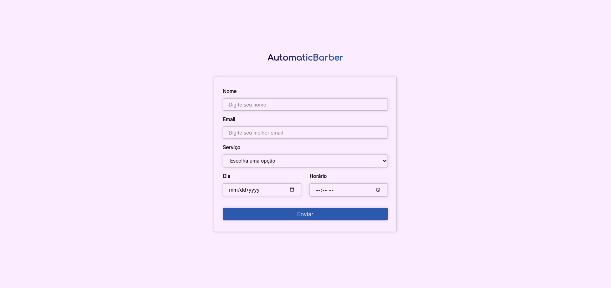

# Automatic Barber

### Ideia

A ideia do projeto seria treinar minhas habilidades de frontend e backend em um projeto simples e fácil de entender.

Você acessa a tela principal,

### Como rodar o projeto

1. Clone o projeto
```bash
git clone https://github.com/abnerpersio/automatic-barber.git
```

2. Instale as dependências
```bash
yarn install # ou npm install
```

##### Em desenvolvimento:

```bash
yarn dev # ou npm run dev
```

##### Em produção:


1. Faça o build do projeto
```bash
yarn build # ou npm run build
```

2. Rode o arquivo de build
```bash
yarn start # ou npm run start
```

##### Em produção (utilizando o Docker):
```bash
docker-compose up
```

### Screenshots

Tela principal de registro de consultas:

